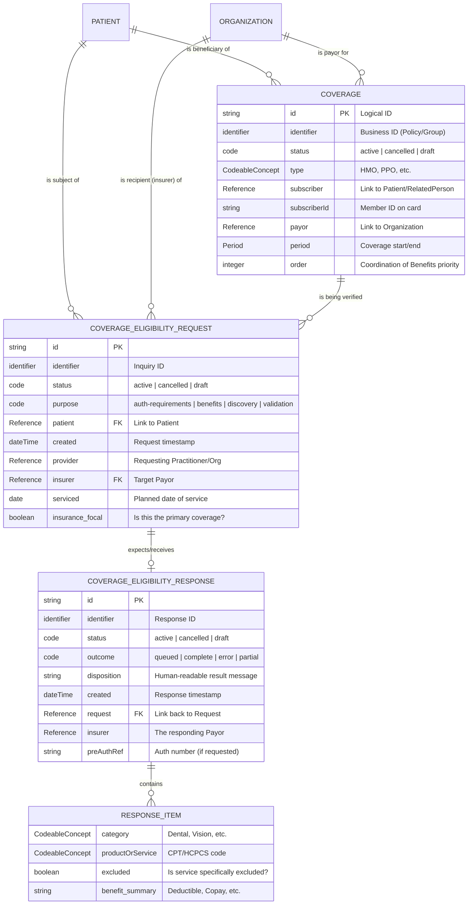

# Insurance Eligibility Data Model (HL7 FHIR)

## Project Overview

In healthcare, verifying if a patient has active insurance and what their benefits cover (deductibles, copays) is a critical step before care is provided. This project models the "Transaction Triple" using the **HL7® FHIR® R4** standard to facilitate real-time eligibility checks between a Provider (EHR) and an Insurer (Payer).

The following Entity Relationship Diagram (ERD) visualizes the logical flow of an insurance eligibility check. It maps how a patient’s static coverage information transitions into a dynamic request-and-response transaction. This model ensures that all participants (Patient, Provider, and Insurer) are synchronized through linked FHIR resources.

## Data Architecture (ERD)

## FHIR Resources Used

* **[Coverage](https://www.hl7.org/fhir/R4/coverage.html):** Represents the "Insurance Card." It contains the member ID, the payer (e.g., Aetna, Medicare), and the plan type.
* **[CoverageEligibilityRequest](https://www.hl7.org/fhir/R4/coverageeligibilityrequest.html):** The digital "question" sent by the provider to ask if specific services are covered on a specific date.
* **[CoverageEligibilityResponse](https://www.google.com/search?q=https://www.hl7.org/fhir/R4/coverageeligibilityresponse.html):** The digital "answer" containing the outcome, authorization requirements, and detailed benefit items (copays/deductibles).

## Implementation Examples

You can find valid FHIR JSON samples for these resources in the `/samples` folder:

* [Coverage Sample](./samples/coverage.json)
* [Eligibility Request](./samples/request.json)
* [Eligibility Response](./samples/response.json)

## Validation & Testing

To ensure the technical accuracy and interoperability of this data model, the following validation layers were implemented:
1. Schema Validation (HL7 FHIR R4)

The JSON samples were validated using the Inferno FHIR Resource Validator.

    Version: FHIR R4 (4.0.1)

    Status: 100% Passing (No Errors)

    Verified Constraints:

        dom-6: Confirmed all resources contain a human-readable Narrative (text element).

        Cardinality: Verified that mandatory fields (such as patient and purpose in the Response) are present to meet the 1..1 requirement.

2. Referential Integrity Check

I manually verified the "Transaction Chain" to ensure the resources are correctly linked via Logical IDs:

    CoverageEligibilityRequest.insurance.coverage → points to Coverage/policy-123

    CoverageEligibilityResponse.request → points to CoverageEligibilityRequest/req-456

    CoverageEligibilityResponse.insurance.coverage → points to Coverage/policy-123

3. Terminology & Binding Verification

Each CodeableConcept was checked against the official HL7 Terminology (UTG):

    Benefit Category: Verified code 30 against http://terminology.hl7.org/CodeSystem/ex-benefitcategory.

    Benefit Type: Verified code copay against http://terminology.hl7.org/CodeSystem/benefit-type and updated the display name to the canonical "Copayment per service" to satisfy strict terminology binding.

How to Verify These Samples Yourself

If you would like to test the validity of the data in this repository

    Copy the contents of samples/response.json.

    Navigate to the HL7 FHIR Validator.

    Paste the JSON and ensure the "Validation Profile" is set to HL7 FHIR Release 4.

    Click Validate.

## Key Learning Outcomes

* **Interoperability:** Mapping complex healthcare workflows to the international FHIR R4 standard.
* **Cardinality:** Managing 1:N relationships between a single policy (`Coverage`) and multiple verification attempts (`Requests`).
* **Data Modeling:** Identifying "Summary" fields (Σ) essential for lightweight, performant API transactions.
