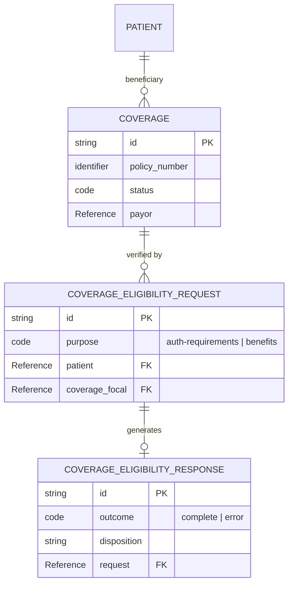

# Insurance Eligibility Data Model (HL7 FHIR)

## Project Overview

In healthcare, verifying if a patient has active insurance and what their benefits cover (deductibles, copays) is a critical step before care is provided. This project models the "Transaction Triple" using the **HL7® FHIR® R4** standard to facilitate real-time eligibility checks between a Provider (EHR) and an Insurer (Payer).

## Data Architecture (ERD)

This diagram illustrates the relationship between the policy holder, the inquiry, and the response.

## FHIR Resources Used

* **[Coverage](https://www.hl7.org/fhir/R4/coverage.html):** Represents the "Insurance Card." It contains the member ID, the payer (e.g., Aetna, Medicare), and the plan type.
* **[CoverageEligibilityRequest](https://www.hl7.org/fhir/R4/coverageeligibilityrequest.html):** The digital "question" sent by the provider to ask if specific services are covered on a specific date.
* **[CoverageEligibilityResponse](https://www.google.com/search?q=https://www.hl7.org/fhir/R4/coverageeligibilityresponse.html):** The digital "answer" containing the outcome, authorization requirements, and detailed benefit items (copays/deductibles).

## Implementation Examples

You can find valid FHIR JSON samples for these resources in the `/samples` folder:

* [Coverage Sample](.samples/coverage.json)
* [Eligibility Request](.samples/request.json)
* [Eligibility Response](.samples/response.json)

## Key Learning Outcomes

* **Interoperability:** Mapping complex healthcare workflows to the international FHIR R4 standard.
* **Cardinality:** Managing 1:N relationships between a single policy (`Coverage`) and multiple verification attempts (`Requests`).
* **Data Modeling:** Identifying "Summary" fields (Σ) essential for lightweight, performant API transactions.
